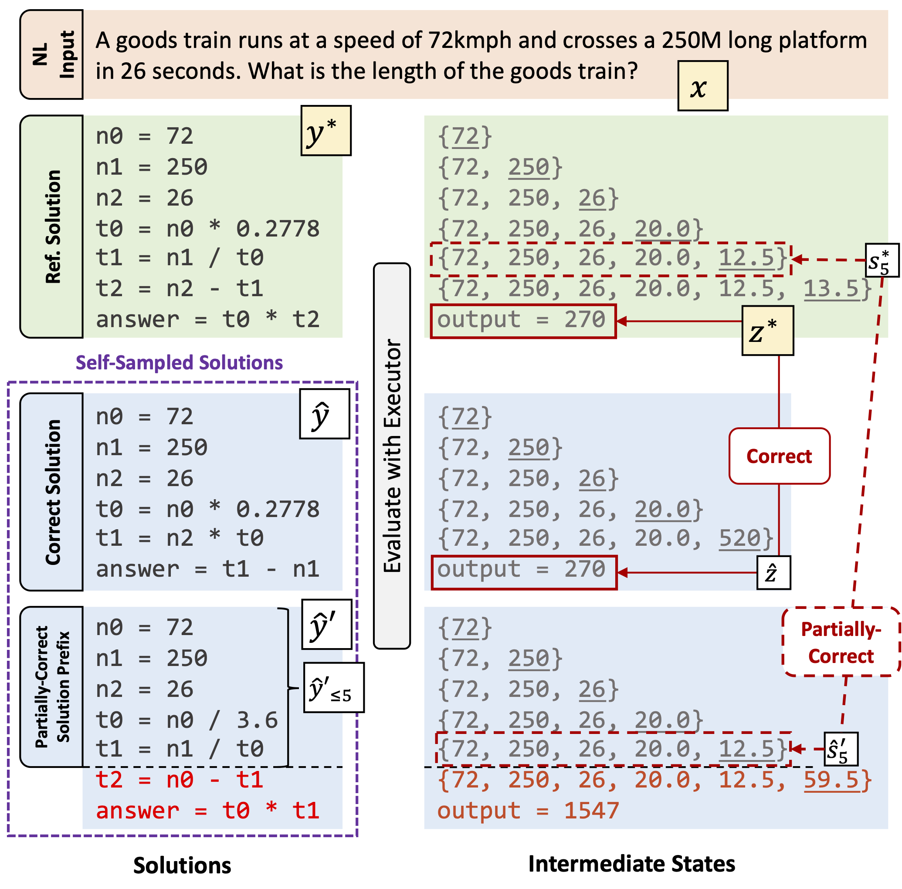

# Learning Math Reasoning from Self-Sampled Correct and Partially-Correct Solutions (ICLR'23)
<p align="left">
    <a href="https://img.shields.io/github/license/niansong1996/lever">
        
    </a>
    <a href="https://img.shields.io/github/last-commit/HKUNLP/Binder?color=green">
        
    </a>
    <a href="https://img.shields.io/badge/PRs-Welcome-red">
        
    </a>
    <br/>
</p>

Code for paper [Learning Math Reasoning from Self-Sampled Correct and Partially-Correct Solutions](https://arxiv.org/abs/2205.14318). In this work, we propose to let the model perform sampling during training and learn from those self-sampled correct or partially-correct solutions, which are automatically identified by comparing the final or intermediate execution states. An example is shown as below.
<p align="center">
    
</p>

## Updates
- **2023-03-08**: Initial code release
- **2023-02-17**: Camera-ready version updated on [arxiv](https://arxiv.org/abs/2205.14318)
- **2023-01-20**: Paper is accepted at ICLR 2023

## Environment Setup
> **Note: all of the following has only been tested on Linux machines, you may need to build your own `tree-sitter` parsers if a different platform is used.**  

*(Recommended)* Create a new conda environment
```bash
conda create -n trace-codegen python=3.8
conda activate trace-codegen
```
Clone the code and install the dependencies
```bash
git clone git@github.com:microsoft/TraceCodegen
cd TraceCodegen
pip install -r requirements.txt
```
*(Optional)* Set up `wandb` for experiment tracking. First following [wandb documentation](https://docs.wandb.ai/ref/cli/wandb-login) to login, then change the following lines in `trainer.logger+` fields of the `yaml` config file you would like to run:
```yaml
entity: <your-user/org-name>
project: <your-project-name>
```
*(Optional)* At any point, if you met with the Python import problem (e.g., `ModuleNotFoundError`), try doing this in the main (`TraceCodegen`) directory:
```bash
export PYTHONPATH=`pwd`
```

## Data and Preprocessing
We conduct experiments on the [MathQA-Python](https://arxiv.org/abs/2108.07732) and [GSM8k](https://github.com/openai/grade-school-math) datasets. As they have different licenses and preprocessing pipelines, here we describe them separately. But first, let's make a `data` directory:
```bash
mkdir data
```
### MathQA-Python
First follow [this script](https://github.com/google/trax/blob/master/trax/examples/MathQA_Python_generation_notebook.ipynb) for generation the MathQA-Python dataset from the [original MathQA dataset](https://math-qa.github.io/). After that, make sure your data directory looks something like this:
```
data
|-- mathqa
|   |-- train-python.jsonl
|   |-- val-python.jsonl
|   |-- test-python.jsonl
|---...
```
We preprocess MathQA-Python by respliting the data with template-based deduplication (see detail in paper). To do this, run the preprocessing script with the following:
```bash
python resplit_mathqa_python.py
```
After this, your `data` directory should now look something like this:
```
data
|-- mathqa
|   |-- train-python.jsonl
|   |-- val-python.jsonl
|   |-- test-python.jsonl
|   |-- train_dedup.jsonl
|   |-- val_dedup.jsonl
|---...
```
Note that we only combine and resplit the orignal train and validation set, and the test set kept untouched.

### GSM8k
As the solution to GSM8k questions are originally annotated as math formulas, we used a script to automatically extract 
MathQA-Python style programs as solutions. To replicate this, first download the data from the 
[original GSM8k repo](https://github.com/openai/grade-school-math/tree/master/grade_school_math/data). After that, your `data` directory should look like this:
```
data
|-- gsmath
|   |-- train.jsonl
|   |-- test.jsonl
|   |-- ...
|---...
```
Now run the preprocessing script for GSM8k:
```bash
python preprocessing/preprocess_gsm8k.py
```
After this, your `data` directory should look like this:
```
data
|-- gsmath
|   |-- train.jsonl
|   |-- test.jsonl
|   |-- gsmath_train.jsonl
|   |-- gsmath_val.jsonl
|   |-- gsmath_test.jsonl
|   |-- ...
|---...
```

## Model Training
Our training framework is built on top of [PyTorch-Lightning](https://pytorch-lightning.readthedocs.io/en/latest/) (version 1.5.10). More specifically, you would only need to change the `yaml` configuration files if you would like to adjust the hyperparameters (e.g., batch size, gpus, dataset file, etc). 

> **Note: To run model training, we recommend using GPUs that have at least 32GiB of memory, or decrease the training batch size accordingly. All our experiments are conducted on 8x V100-32GB GPUs.**

### Basic usage
```bash
python trainer.py fit --config <config_file_path>.yaml
```
Existing `yaml` config files can be found in `training_configs`, you can also find all the hyperparameter settings (e.g., batch size) in the Appendix of the paper. 

### Using different transformer models
If you would like to switch between `GPT-Neo-125M` and `GPT-Neo-2.7B` models, be sure to change the following fields in the `yaml` config file:
```yaml
trainer:
  ...
  strategy: deepspeed_stage_2_offload # for 2.7B, or "ddp_find_unused_parameters_false" for 125M
...
model:
  class_path: ...
  init_args:
    transformer_model_name: &transformer EleutherAI/gpt-neo-2.7B # or EleutherAI/gpt-neo-125M
...
data:
  class_path: ...
  init_args:
    ...
    batch_size: 2 # [Optional] change this according to the GPU memory
    val_batch_size: 4 # [Optional] change this according to the GPU memory
...
```

### Using different datasets
Since the MathQA-Python and GSM8k datasets are in the same format after preprocessing, you just need to change the file paths in the following fields of the `yaml` config file:
```yaml
data:
    ...
    train_file_path: data/mathqa/train_dedup.jsonl # or "data/gsmath/gsmath_train.jsonl" for gsm8k
    val_file_path: data/mathqa/val_dedup.jsonl # or "data/gsmath/gsmath_val.jsonl" for gsm8k
```

### Use fully- or partially-correct self-sampled solutions
To this end, you just need to use different `yaml` config files in `training_configs`:
```bash
training_configs/gpt_self_sampling.yaml # for using self-sampled fully-correct solutions only
training_configs/gpt_self_sampling_partial.yaml # for also using self-sampled partially-correct solutions
```

### Using different learning objectives
- For the MLE baseline, just run with the config file of `training_configs/gpt_mle.yaml`
- For running MML, set the following in the `yaml` config file:
```yaml
model:
    ...
    init_args:
        ...
        mle_lambda: 0.0
        mml_lambda: 1.0
    ...
```
- For running $\beta$-MML, keep the above and set `beta_smoothing: <beta>`
- For running MLE-Aug, set `mle_lambda: 1.0` and `mml_lambda: 0.0` in above.

### All other hyperparameters
For all other hyperparameters, please read the rest of the fields in the `yaml` file and the corresponding `__init__` function in the corresponding class, or refer to the [pytorch-lightning documents](https://pytorch-lightning.readthedocs.io/en/1.5.10/).

## Model Inference
For running model inference (e.g., on the test set), use the following command:
```bash
python trainer.py validate --config <your-config-file> --model.init_args.load_ckpt_file <saved_ckpt_file>
```

## Citation
If you use the code in this repository, consider cite:
```bibtex
@inproceedings{ni2023selfsampling,
  title={Learning Math Reasoning from Self-Sampled Correct and Partially-Correct Solutions},
  author={Ni, Ansong and Inala, Jeevana Priya and Wang, Chenglong and Polozov, Alex and Meek, Christopher and Radev, Dragomir and Gao, Jianfeng},
  booktitle={The 2023 International Conference on Learning Representations}
}
```
For any questions, please open an issue. PRs are definitely welcomed, and please check the following section about contributing to this repo. 

## Contributing

This project welcomes contributions and suggestions.  Most contributions require you to agree to a
Contributor License Agreement (CLA) declaring that you have the right to, and actually do, grant us
the rights to use your contribution. For details, visit https://cla.opensource.microsoft.com.

When you submit a pull request, a CLA bot will automatically determine whether you need to provide
a CLA and decorate the PR appropriately (e.g., status check, comment). Simply follow the instructions
provided by the bot. You will only need to do this once across all repos using our CLA.

This project has adopted the [Microsoft Open Source Code of Conduct](https://opensource.microsoft.com/codeofconduct/).
For more information see the [Code of Conduct FAQ](https://opensource.microsoft.com/codeofconduct/faq/) or
contact [opencode@microsoft.com](mailto:opencode@microsoft.com) with any additional questions or comments.

## Trademarks

This project may contain trademarks or logos for projects, products, or services. Authorized use of Microsoft 
trademarks or logos is subject to and must follow 
[Microsoft's Trademark & Brand Guidelines](https://www.microsoft.com/en-us/legal/intellectualproperty/trademarks/usage/general).
Use of Microsoft trademarks or logos in modified versions of this project must not cause confusion or imply Microsoft sponsorship.
Any use of third-party trademarks or logos are subject to those third-party's policies.
